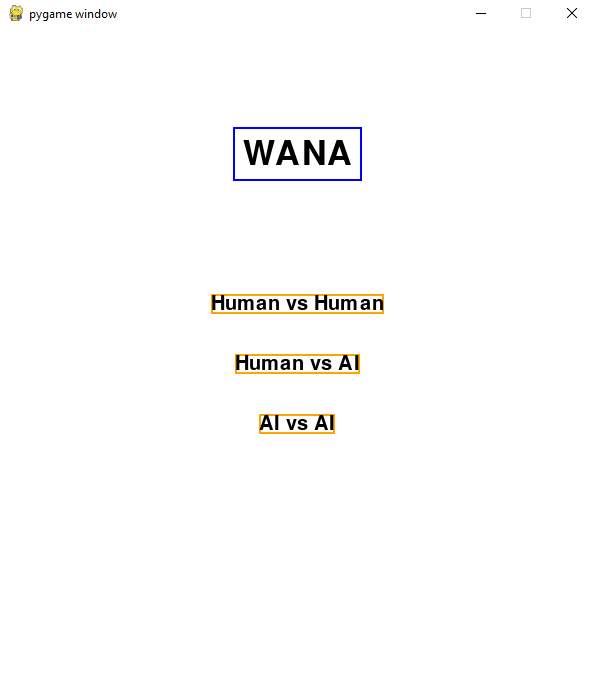
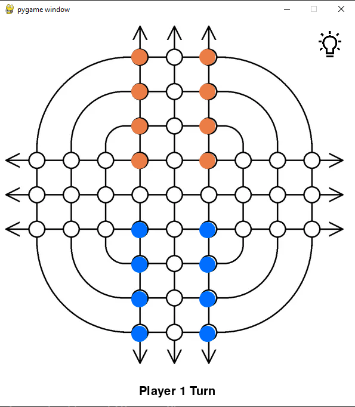
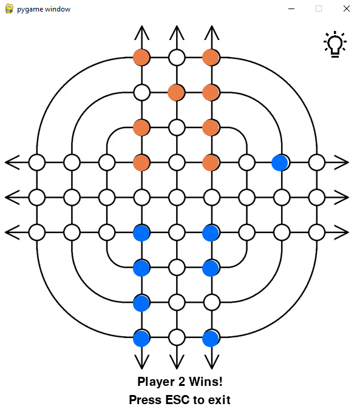

# WANA

## Compilation and Specifications

To play the game, run ```pyhton Game.py``` on the parent folder. After this, the menu will appear.



The menu has 3 options corresponding with the game modes of the game:
    - Human-Human
    - Human-Computer
    - Computer-Computer

The computer has 3 levels of difficulty, corresponding to different evaluation functions and depths used in the Minimax algorithm:
    - Easy
    - Medium
    - Hard

After choosing the game mode options, the screen will show the initial board and the user can begin the game.



The player whose turn it is can press the **hint** button at the top right corner and the piece and move will be highlighted.

After one of the player wins, the final game state will be displayed and the user can use esc to exit.



## Short Game Description (provided by the designer)

In this game, each player has 8 marbles of their color (orange for player 1 and blue for player 2). They are placed on divot at the intersection between the lines.

On your turn you must move one of your marble. A marble can move as far as you want along a line. 
A marble cannot move through, or onto the same space as another marble. 
A marble that travel off the board will appear and continue traveling from the opposite side.

If you have a marble that cannot be moved at the beginning of your turn you lose the game.
